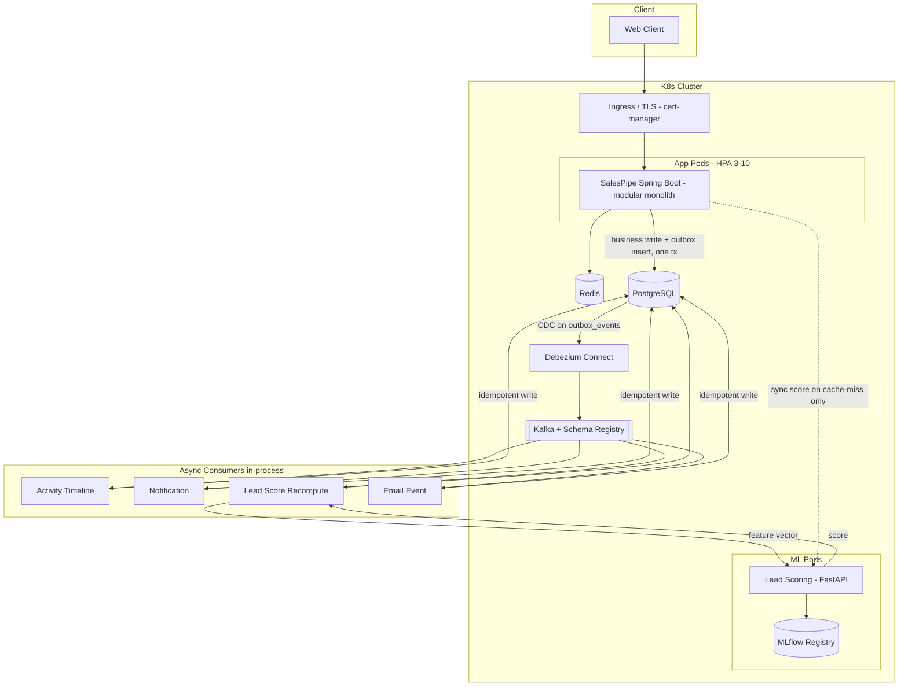
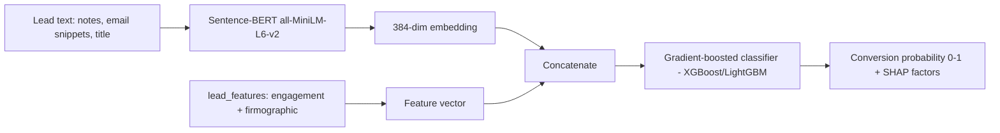

<div align="center">

# SalesPipe — B2B SaaS Sales CRM

**A multi-tenant B2B Sales CRM built as a modular monolith on Kubernetes.**

Event-driven architecture · distributed-systems primitives · a real ML lead-scoring pipeline.

</div>

---

## Table of contents

- [What it is](#what-it-is)
- [Why this project](#why-this-project)
- [Feature scope — everything this project will do](#feature-scope--everything-this-project-will-do)
- [Architecture](#architecture)
- [Domain model](#domain-model)
- [Event-driven design](#event-driven-design)
- [AI lead scoring](#ai-lead-scoring)
- [Security & multi-tenancy](#security--multi-tenancy)
- [Observability, resilience & performance](#observability-resilience--performance)
- [Tech stack](#tech-stack)
- [Build roadmap (phases)](#build-roadmap-phases)
- [API surface](#api-surface)
- [Repository layout](#repository-layout)
- [Getting started](#getting-started)
- [Testing strategy](#testing-strategy)
- [Documentation](#documentation)
- [License](#license)

---

## What it is

SalesPipe is a multi-tenant B2B Sales CRM. Sales teams move **Leads → Deals** through a **Kanban pipeline**, log **activities** (calls, emails, notes, meetings), track **email opens/clicks**, and get **AI-ranked lead scores** that predict conversion likelihood.

Internally the system is **event-driven**: state changes emit domain events that are consumed asynchronously to update timelines, fire notifications, and recompute lead scores — without blocking the request thread. It is a **modular monolith** (not microservices) that still ships on **Kubernetes**, because the operational skills — scaling, config/secrets, zero-downtime rollout, observability — are valuable independent of how many deployable units exist.

> **Status:** Implementation plan complete. Code is built phase by phase from the plan in [`docs/plan/`](docs/plan/). This README describes the full intended scope.

---

## Why this project

A CRUD CRM is forgettable. This one is engineered to survive a system-design interview — you should be able to talk for 20+ minutes about any single area below.

| Area | What it demonstrates |
|---|---|
| **Domain modeling** | Multi-tenant B2B domain with real invariants (pipeline stages, ownership, audit trail) |
| **Distributed systems** | Transactional outbox, CDC, idempotent consumers, at-least-once delivery, eventual consistency |
| **Async architecture** | Kafka event bus decoupling the write path from side effects (notifications, scoring, timeline) |
| **ML in production** | Real feature engineering (embeddings + structured signals) → supervised classifier, model registry, offline retraining — not "call an API and call it AI" |
| **Production concerns** | Observability, resilience (circuit breakers, retries, DLQs), rate limiting |
| **Platform / DevOps** | Containerization, Kubernetes, Helm, HPA + KEDA, GitOps CI/CD |
| **Testing discipline** | Testcontainers integration tests, contract tests, load tests |

---

## Feature scope — everything this project will do

### Product features
- **Tenant/org onboarding** — self-serve org creation, first admin user.
- **Users & RBAC** — roles `ADMIN` / `MANAGER` / `SALES_REP`, enforced per endpoint.
- **Accounts & contacts** — companies and the people at them.
- **Leads** — inbound/outbound leads with source, status, owner, free-text notes.
- **Kanban pipeline** — org-configurable stages; drag deals across stages with concurrency-safe updates and full stage-change history.
- **Deals** — amount, currency, expected close date, time-in-stage tracking.
- **Activity timeline** — append-only, unified feed of calls / emails / notes / meetings / stage changes per entity, populated asynchronously.
- **Email tracking** — outbound send, open-pixel and click-redirect tracking with forgery-proof signed tokens, provider webhook ingestion (bounces/deliveries).
- **AI lead scoring** — live conversion-probability score per lead, with history and SHAP "why is this lead hot" explanations.
- **Notifications** — in-app + email, triggered by domain events (deal stalled, hot-lead threshold crossed, mentions/assignments).
- **Reporting** — pipeline analytics, conversion funnel, rep leaderboards.
- **Audit log** — who changed what, with a JSON diff.
- **GDPR / tenant deletion** — hard-delete of all data for a tenant, plus retention windows on high-volume event tables.

### Engineering features
- Modular monolith with **compile/test-time module boundaries** (Spring Modulith + ArchUnit) — a cross-module violation fails the build.
- **Transactional outbox → Debezium CDC → Kafka** — the app never dual-writes; correctness by construction.
- **Idempotent consumers** with a `processed_events` dedupe store — at-least-once delivery made safe.
- **Schema Registry** enforcing backward-compatible event evolution.
- **Rotating refresh tokens with reuse detection** — replaying a rotated token revokes the whole family.
- **Async ML recompute as source of truth**, resilient sync fallback to last-known score.
- **Distributed tracing across the Kafka boundary** — follow one request producer → consumer → DB → notification.
- **DLQ + replay tooling** — no silent message loss.
- **Load-test-derived** connection-pool and resource sizing (not guessed).
- **KEDA autoscaling on Kafka consumer lag**; **GitOps** delivery via Argo CD; **External Secrets** via Vault/ESO.

---

## Architecture



**Key property:** the app never produces to Kafka directly. It writes business state **and** an `outbox_events` row in one transaction; Debezium streams that table to Kafka. This is the transactional-outbox guarantee made real — no dual-write bug.

### Modules (package-by-feature)

| Module | Responsibility |
|---|---|
| `identity` | Org onboarding, users, roles, JWT auth |
| `crmcore` | Accounts, contacts, leads |
| `pipeline` | Deals, stages, Kanban transitions, stage history |
| `activity` | Append-only activity timeline (Kafka-populated) |
| `emailtracking` | Email send, open/click tracking, webhook ingestion |
| `scoring` | Feature aggregation, ML calls, score persistence + history |
| `notification` | In-app + email notifications from domain events |
| `eventing` | Outbox, producer/consumer infra, event schemas |
| `reporting` | Pipeline analytics, funnel, leaderboards |
| `common` | Tenant context, auditing, exceptions, base entities |

Each module owns its tables and talks to others **only** via a public API interface or domain events — never a foreign repository. `ApplicationModules.of(App.class).verify()` runs in CI.

---

## Domain model

Core tables (all carry `org_id` except `organizations`; composite `(org_id, …)` indexes on hot paths):

`organizations` · `users` · `refresh_tokens` (rotating families) · `accounts` · `contacts` · `leads` · `deal_stages` · `deals` · `deal_stage_history` · `activities` (partitioned monthly) · `emails` · `email_events` (partitioned monthly) · `lead_features` (feature store) · `lead_scores` (full history) · `notifications` · `outbox_events` · `processed_events` (idempotency) · `audit_log`.

Full schema with types, indexes, and partitioning is in [`docs/plan/00-overview.md`](docs/plan/00-overview.md) §4.

---

## Event-driven design

| Topic | Producer (via outbox) | Key | Consumers |
|---|---|---|---|
| `deal.stage.changed` | pipeline | `deal_id` | activity, notification, scoring |
| `lead.created` | crmcore | `lead_id` | scoring, activity |
| `email.event.received` | emailtracking | `lead_id` | activity, scoring |
| `lead.score.updated` | scoring | `lead_id` | notification, activity |
| `activity.logged` | multiple | `entity_id` | notification |

- Kafka chosen over RabbitMQ for **replay** (re-score all leads under a new model), **fan-out** (multiple consumer groups), and **KEDA lag-based autoscaling**.
- Partition key gives per-aggregate ordering. Each topic has a matching `*.DLQ`; consumers retry with exponential backoff, then route to DLQ **with a failure reason**.
- Every consumer dedupes via a `processed_events` insert in the same transaction as its business write.

---

## AI lead scoring



- A **supervised classifier trained on your own won/lost outcomes** — the embedding is one signal among structured features (engagement counts, recency, deal velocity, company size, industry, source), not the whole model.
- Served by a Python **FastAPI** service; Java calls it via `WebClient` behind a **Resilience4j circuit breaker + timeout + bulkhead**, with fallback to the last-known score so the UI never blocks on ML latency.
- **Async recompute is the source of truth** — feature-update consumers trigger recompute; a sync call happens only on cache-miss / manual refresh.
- **MLflow** registry handles experiment tracking, model versioning, A/B, and rollback. Offline training (K8s CronJob) evaluates **AUC-ROC + precision@k** and auto-promotes only if it beats the current Production model on a held-out set. `model_version` is stamped on every score row.

---

## Security & multi-tenancy

- **Stateless JWT** — short-lived access token + rotating refresh token (hashed at rest, Redis-mirrored for O(1) revoke) with **reuse detection**.
- **RBAC** via `@PreAuthorize` on ADMIN / MANAGER / SALES_REP.
- **Tenant isolation** — shared schema, Hibernate `@Filter` on `org_id` from the JWT claim (never the request body), enabled globally and guarded by an ArchUnit test that fails the build on any un-scoped query.
- **Email tracking** — HMAC-signed tokens defeat open/click forgery and id enumeration; unsigned requests rejected before any DB write.
- **Rate limiting** — Bucket4j + Redis, per-tenant, on tracking pixel + webhook endpoints.
- **Secrets** — plain K8s Secrets locally; External Secrets Operator + Vault as the production path.
- **GDPR** — tenant hard-delete across every table + partition detach; documented retention windows.

---

## Observability, resilience & performance

- **Metrics** — Micrometer → Prometheus + Grafana: request latency/error per endpoint, Kafka consumer lag, DLQ depth, ML latency, circuit-breaker state, outbox relay lag, DB pool saturation. Alertmanager rules on SLO burn.
- **Tracing** — OpenTelemetry, `trace_id` propagated in Kafka headers across the async boundary.
- **Logging** — structured JSON with `org_id` / `trace_id` / `user_id` in MDC; Loki/ELK optional.
- **Resilience** — circuit breakers (ML + email provider), retries + DLQs, bulkheads, idempotency keys, timeouts on every outbound call; Java 21 virtual threads for I/O-bound consumers.
- **Performance** — HikariCP and K8s resource limits sized from **Gatling** load tests; published p99 latency + consumer lag below; reporting reads target a read-replica.

### Load & chaos test results

Load scenarios (Gatling) and the runbook live in [`loadtest/README.md`](loadtest/README.md);
the simulations are in [`src/gatling/scala`](src/gatling/scala). Assertions baked into each
simulation: Kanban stage-PATCH p99 < 2s at 50 concurrent users with ≥95% success (409s under
optimistic-lock contention are expected, not failures); lead-list pagination p99 < 1s at 100
req/s; tracking-pixel storm zero 5xx at 300 req/s.

> **Environment:** publish the numbers from a run on your target hardware — Gatling on a
> laptop gives laptop numbers. State the host (CPU/RAM), whether Postgres/Kafka shared the
> same Docker engine, and the concurrency, so the p99/lag figures are interpretable. Fill
> the table below from `build/reports/gatling/` after a run; derive `DB_POOL_MAX` and the K8s
> `resources` from the saturation point (see the loadtest README).

| Scenario | Concurrency | p95 | p99 | Notes |
|---|---|---|---|---|
| Kanban stage burst | 50 | _run_ | _run_ | 409 = lock contention |
| Lead pagination | 100 req/s | _run_ | _run_ | read path |
| Pixel storm | 300 req/s | _run_ | _run_ | public, rate-limited |

**Chaos-lite (measured, `ConsumerKillNoLossIT`):** a consumer killed mid-drain of a 300-event
burst and restarted recovers to **exactly-once** — all 300 events processed, zero lost, zero
double-processed (verified via `processed_events` count). This is the transactional-outbox +
idempotent-consumer guarantee holding across a consumer crash.

---

## Tech stack

| Layer | Choice |
|---|---|
| Language / framework | Java 21 (virtual threads), Spring Boot 3.x, Spring Modulith |
| Persistence | PostgreSQL 16, Spring Data JPA / Hibernate, Flyway |
| Caching / rate limit | Redis, Bucket4j |
| Event bus | Apache Kafka + Schema Registry, Debezium (CDC outbox relay) |
| Security | Spring Security 6, JWT (access + rotating refresh w/ reuse detection), RBAC |
| Resilience | Resilience4j (circuit breaker, retry, bulkhead, rate limiter) |
| Object mapping | MapStruct |
| ML service | Python, FastAPI, sentence-transformers, XGBoost/LightGBM, MLflow, SHAP |
| Observability | Micrometer → Prometheus + Grafana, OpenTelemetry, structured JSON logs |
| Containerization | Docker (multi-stage, distroless/JRE-slim) |
| Orchestration | Kubernetes + Helm |
| Autoscaling | HPA + KEDA (scale consumers on Kafka lag) |
| CI/CD | GitHub Actions → container registry → Argo CD (GitOps) |
| Secrets | K8s Secrets → External Secrets Operator + Vault |
| Testing | JUnit 5, Mockito, Testcontainers, RestAssured, Gatling, pytest |
| Frontend | Next.js 15 (App Router), TypeScript, Tailwind CSS + shadcn/ui, TanStack Query, dnd-kit, Vitest + Playwright |

---

## Build roadmap (phases)

Each phase is independently demoable. Full task breakdown, acceptance criteria, and CORE/STRETCH tiers live in [`docs/plan/`](docs/plan/).

| Phase | Focus | Demo at end |
|---|---|---|
| **[1 — Core CRUD monolith](docs/plan/phase-1-core-monolith.md)** | Auth, multi-tenancy, CRM core, Kanban, Docker, K8s | Log in, create leads, drag deals, tenant-isolated |
| **[2 — Event backbone](docs/plan/phase-2-event-backbone.md)** | Outbox → CDC → Kafka, idempotent consumers, timeline, email tracking | Timeline populates async; email opens tracked |
| **[3 — AI lead scoring](docs/plan/phase-3-ai-scoring.md)** | Feature store, FastAPI service, MLflow, training, SHAP | Live score + history + factors; graceful ML fallback |
| **[4 — Production hardening](docs/plan/phase-4-production-hardening.md)** | Observability, tracing, resilience, DLQ, GDPR, Gatling | Grafana dashboards, end-to-end traces, published p99 |
| **[5 — Platform polish](docs/plan/phase-5-platform.md)** | Helm, KEDA, Argo CD GitOps, External Secrets | One-command zero-downtime deploy; lag-based scaling |
| **[6 — Frontend](docs/plan/phase-6-frontend.md)** | Next.js web client: Kanban, lead detail, score + SHAP, notifications, reports | Full browser demo of the golden path, end to end |

> Do not start a phase before the prior phase's **CORE** tasks pass their acceptance tests. Phase 6 only requires Phases 1–4's APIs to be usable.

---

## API surface

Selected endpoints (full contract via `springdoc-openapi` at `/swagger-ui.html`):

| Method | Endpoint | Notes |
|---|---|---|
| `POST` | `/api/v1/auth/login` | Access + refresh JWT |
| `POST` | `/api/v1/auth/refresh` | Rotating refresh, reuse detection |
| `GET` | `/api/v1/leads?status=&owner=&page=` | Paginated, filterable |
| `POST` | `/api/v1/leads` | |
| `PATCH` | `/api/v1/deals/{id}/stage` | Emits `deal.stage.changed`, optimistic lock |
| `GET` | `/api/v1/deals/pipeline` | Grouped by stage for Kanban |
| `GET` | `/api/v1/leads/{id}/timeline` | Merged activity feed |
| `GET` | `/api/v1/leads/{id}/score` | Latest + history |
| `GET` | `/api/v1/emails/{trackingId}/open` | Signed 1×1 pixel, async-logs open |
| `GET` | `/api/v1/emails/{trackingId}/click` | Signed redirect, async-logs click |
| `POST` | `/api/v1/webhooks/email` | Provider bounce/delivery ingestion |
| `GET` | `/api/v1/reports/funnel` | Conversion funnel |

---

## Repository layout

```
.
├── README.md                         # this file
├── CLAUDE.md                         # agent working guidance + commit rules
├── b2b-saas-crm-design-document.md   # original SDD
├── charts/                           # Helm charts: salespipe (app) + lead-scoring (ML)
├── gitops/                           # Argo CD Applications + CI-bumped image tags
├── platform/                         # cluster add-ons (External Secrets Operator wiring)
├── .github/workflows/                # CI: test → push images → bump gitops
└── docs/
    └── plan/
        ├── README.md                 # plan index
        ├── 00-overview.md            # architecture, schema, decision log, tiers
        ├── phase-1-core-monolith.md
        ├── phase-2-event-backbone.md
        ├── phase-3-ai-scoring.md
        ├── phase-4-production-hardening.md
        ├── phase-5-platform.md
        └── phase-6-frontend.md
```
Application code (`com.salespipe.*` modules, the Python `lead-scoring-service`, and the `frontend/` Next.js app) is added as each phase is built.

---

## Getting started

> Code is not built yet. Once Phase 1 lands, local dev will be:

```bash
# bring up Postgres + Redis (+ Kafka from Phase 2 on)
docker compose up -d

# run the app
./gradlew bootRun

# API docs
open http://localhost:8080/swagger-ui.html

# frontend (Phase 6)
cd frontend && npm run dev
open http://localhost:3000
```

The plan targets `docker compose` for local development and Helm on a Kubernetes cluster (kind/minikube locally) for the deployment story.

---

## Deployment (Phase 5)

Two Helm charts under `charts/`: `salespipe` (the app) and `lead-scoring` (the ML service,
separately sized because the embedding model lives in memory). Each templates a Deployment,
Service, ConfigMap, probes, `RollingUpdate` (surge 1 / unavailable 0 for zero-downtime),
HPA, and PodDisruptionBudget; the app chart adds nginx Ingress + cert-manager TLS, a KEDA
`ScaledObject`, and an ESO `ExternalSecret`. Per-env overlays: `values-staging.yaml`,
`values-prod.yaml` (prod raises resources off the Phase 4 load numbers — demo limits are
never inherited).

```bash
# local (kind/minikube): plain Secret + CPU HPA, no vault/KEDA needed
helm install salespipe ./charts/salespipe -n salespipe --create-namespace
helm install lead-scoring ./charts/lead-scoring -n salespipe

# staging/prod: KEDA lag-scaling + ESO secrets
helm upgrade --install salespipe ./charts/salespipe -n salespipe-staging \
  --create-namespace -f ./charts/salespipe/values-staging.yaml
```

**GitOps:** merge to `main` → CI (`.github/workflows/ci.yml`) tests both services, pushes
SHA-tagged images to GHCR, and bumps the staging image tag in `gitops/apps/`. Argo CD
(`gitops/argocd/`) auto-syncs staging; prod is a manual promote. If Argo isn't installed,
the same charts deploy via `helm upgrade` (see `gitops/README.md`).

**KEDA** scales the consumer path on Kafka consumer-group lag (`scoring-features-*`), not
CPU — pause consumers + flood the topic and pods scale up, drain and they scale back to min.
Fallback is the CPU HPA (`keda.enabled=false`, `hpa.enabled=true`).

**Secrets** (`platform/external-secrets/`): External Secrets Operator syncs `DB_PASSWORD` /
`JWT_SECRET` from Vault into a native K8s Secret (`secret.mode=eso`). No secret material in
git or ConfigMaps. Local fallback is `secret.mode=plain` (documented dev-only gap).

### Local vs managed services

The stateful backing services are **in-cluster** for local/demo and **managed** in a real
deployment. What was actually run here: everything in-cluster (StatefulSet/PVC) on kind — no
cloud spend. The managed migration path is a values/connection-string change, not a code
change (all endpoints come from ConfigMap/Secret, wired in Phases 1–2):

| Service | Local (ran here) | Managed ("real") | Migration |
|---|---|---|---|
| Postgres | StatefulSet + PVC (`k8s/postgres.yaml`) | AWS RDS / Aurora | point `DB_URL` at the RDS endpoint; drop the in-cluster StatefulSet |
| Redis | Deployment (`k8s/redis.yaml`) | ElastiCache | set `REDIS_HOST` to the ElastiCache endpoint |
| Kafka | in-cluster broker | MSK / Confluent Cloud | set `KAFKA_BOOTSTRAP_SERVERS` + `SCHEMA_REGISTRY_URL`; add SASL creds via ESO |

Managed services move backups, HA, and patching to the provider; the in-cluster versions
are single-replica and dev-only (no PITR, no multi-AZ).

---

## Testing strategy

| Type | Tool | Scope |
|---|---|---|
| Unit | JUnit 5 + Mockito | Service/domain logic |
| Integration | Testcontainers (Postgres, Kafka, Redis) | Real infra, not mocks |
| API/contract | RestAssured | OpenAPI contract holds |
| Module boundary | ArchUnit / Spring Modulith | Build fails on boundary or tenant-scope violations |
| Load | Gatling | Kanban bursts, consumer throughput; published p99 + lag |
| ML service | pytest | Feature pipeline, inference, promotion, data-leakage |
| Frontend unit/component | Vitest + React Testing Library | Drag logic, score/SHAP rendering, form validation |
| Frontend E2E | Playwright | Golden path against a real (containerized) backend |

---

## Documentation

- [`docs/plan/`](docs/plan/) — implementation plan; **start with the [overview](docs/plan/00-overview.md)**.
- [`b2b-saas-crm-design-document.md`](b2b-saas-crm-design-document.md) — original software design document.

---

## License

MIT
