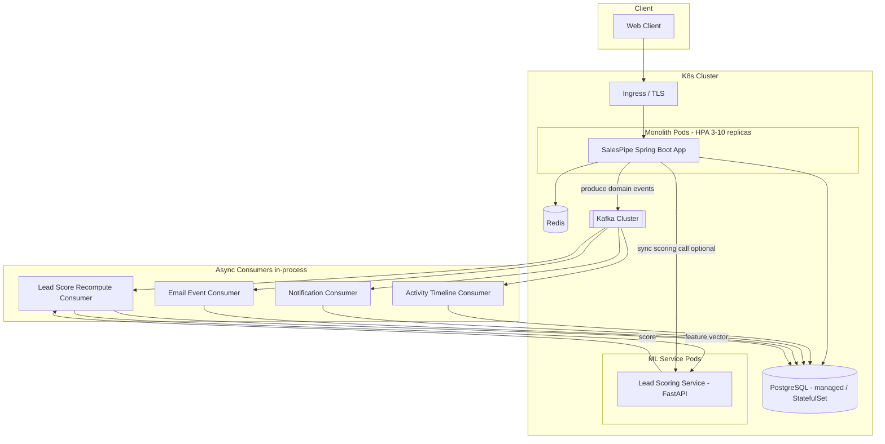
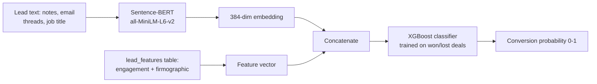

# SalesPipe — B2B SaaS Sales CRM
### Software Design Document (SDD)

**Author:** _(your name)_
**Version:** 1.0
**Purpose:** Portfolio project demonstrating backend/SDE competency for Java + Spring Boot roles

---

## 1. Overview

SalesPipe is a multi-tenant B2B Sales CRM. Sales teams manage **Leads → Deals** through a **Kanban pipeline**, log **Activities** (calls, emails, notes, meetings), track **email opens/clicks**, and get **AI-ranked lead scores** that predict conversion likelihood. Internally, the system is event-driven: state changes emit domain events consumed asynchronously to update timelines, trigger notifications, and recompute lead scores — without blocking the request thread.

Architecturally it is a **modular monolith**, not microservices. That's a deliberate, defensible choice (see §4.1) — and it still ships on **Kubernetes**, because the operational skills (scaling, config/secrets, zero-downtime rollout, observability) are what interviewers actually care about, independent of how many deployable units you have.

---

## 2. Why This Project Works for an SDE/Java Interview

A CRUD CRM alone is forgettable. What makes this defensible in a system design round:

| Area | What you show |
|---|---|
| **Domain modeling** | Multi-tenant B2B domain with real invariants (pipeline stages, ownership, audit trail) |
| **Distributed systems primitives** | Outbox pattern, idempotent consumers, at-least-once delivery, eventual consistency |
| **Async architecture** | Kafka-based event bus decoupling write path from side effects (notifications, scoring, timeline) |
| **ML integration (not hand-wavy)** | Real feature engineering pipeline: embeddings + structured features → classifier, not "we call an API and call it AI" |
| **Production concerns** | Observability, resilience (circuit breakers, retries, DLQs), rate limiting |
| **Platform/DevOps** | Containerization, K8s manifests, HPA, GitOps CI/CD |
| **Testing discipline** | Testcontainers-based integration tests, contract tests, load tests |

You should be able to talk for 20+ minutes about *any single one* of these sections without repeating yourself. That's the bar.

---

## 3. Tech Stack

| Layer | Choice | Why |
|---|---|---|
| Language | Java 21 (LTS) | Virtual threads (Project Loom) relevant for I/O-bound Kafka consumers/HTTP calls — good talking point |
| Framework | Spring Boot 3.x | Industry standard |
| Module boundaries | **Spring Modulith** | Enforces package-level module boundaries inside the monolith at *compile/test time* — huge interview talking point ("designed for future microservice extraction without actually paying that tax yet") |
| Persistence | PostgreSQL 16 + Spring Data JPA / Hibernate | Relational integrity for tenant + pipeline data |
| Migrations | Flyway | Versioned schema, required for any real project |
| Caching | Redis | Session cache, lead-score cache, rate-limit counters |
| Event bus | **Apache Kafka** (primary) | See §7 for Kafka vs RabbitMQ tradeoff |
| Search (stretch) | Elasticsearch/OpenSearch | Full-text search over leads/notes |
| Security | Spring Security 6 + JWT (access + refresh) | RBAC + multi-tenant row-level scoping |
| API docs | springdoc-openapi (Swagger UI) | Auto-generated OpenAPI spec |
| Resilience | Resilience4j | Circuit breaker, retry, bulkhead, rate limiter |
| Object mapping | MapStruct | DTO ↔ entity mapping, no reflection overhead like ModelMapper |
| ML service | Python + FastAPI + `sentence-transformers` + XGBoost | Embeddings + classifier for lead scoring (§8) |
| Observability | Micrometer → Prometheus + Grafana, OpenTelemetry tracing, structured JSON logs (Loki/ELK) | |
| Containerization | Docker (multi-stage builds) | |
| Orchestration | Kubernetes (K8s) + Helm | |
| Autoscaling | HPA + **KEDA** (scale consumers on Kafka lag) | Goes beyond default CPU-based HPA — strong differentiator |
| CI/CD | GitHub Actions → Docker registry → Argo CD (GitOps) | |
| Testing | JUnit 5, Mockito, Testcontainers, RestAssured, Gatling | |

---

## 4. High-Level Architecture



### 4.1 Why "Monolith on Kubernetes" Is a Legitimate Choice

Say this explicitly in interviews — it preempts the "why not microservices" question:

- **Modular monolith ≠ spaghetti monolith.** Spring Modulith enforces module boundaries (`pipeline`, `activity`, `scoring`, `notification`, `identity`) via `ArchUnit`-style tests in CI. A cross-module import that violates the boundary **fails the build**.
- **K8s isn't only for microservices.** You still need horizontal scaling, rolling/zero-downtime deploys, self-healing, config/secret management, and resource isolation for a single deployable. K8s gives you all of that for one Deployment.
- **Operational simplicity now, optionality later.** No distributed transactions, no service-mesh complexity, one deployable to version/debug/trace — but because domain events already flow through Kafka and modules don't share database transactions, extracting `scoring` or `notification` into a separate service later is a deployment change, not a rewrite.
- **This is exactly what a lot of real "Series A/B SaaS" backends look like** — which is why it reads as credible rather than resume-driven-development.

---

## 5. Module Breakdown (package-by-feature)

| Module | Responsibility |
|---|---|
| `identity` | Tenant/org onboarding, users, roles (ADMIN/MANAGER/SALES_REP), JWT auth |
| `crm-core` | Accounts, Contacts, Leads — the core entities |
| `pipeline` | Deals, pipeline stages, Kanban stage transitions, stage-change history |
| `activity` | Activity timeline (calls, notes, meetings, stage changes, emails) — populated by Kafka consumers, append-only |
| `email-tracking` | Outbound email send, open-pixel tracking, click-redirect tracking, webhook ingestion (SendGrid/SES) |
| `scoring` | Lead scoring: feature aggregation, calls to ML service, score persistence, score history |
| `notification` | In-app + email notifications triggered by domain events (deal stalled, high-score lead, mention, etc.) |
| `eventing` | Shared Kafka producer/consumer infra, outbox publisher, event schemas |
| `reporting` | Pipeline analytics, conversion funnel, rep leaderboards |
| `common` | Cross-cutting: exceptions, auditing, tenant context, base entities |

Each module = one top-level package, own persistence tables it owns, and (per Spring Modulith convention) only talks to other modules via a public API interface or domain events — never by reaching into another module's repository directly.

---

## 6. Database Design

### 6.1 Core Tables (simplified)

```sql
-- Multi-tenancy root
organizations (id, name, plan, created_at)

users (id, org_id, email, password_hash, role, created_at)

accounts (id, org_id, name, industry, employee_count, website, created_at)

contacts (id, org_id, account_id, first_name, last_name, email, phone, title)

leads (
  id, org_id, contact_id, account_id, source, status,
  raw_notes TEXT,                 -- feeds Sentence-BERT embedding
  current_score NUMERIC(5,4),     -- cached latest score
  owner_id, created_at, updated_at
)

deal_stages (id, org_id, name, position, is_won, is_lost)   -- Kanban columns, org-configurable

deals (
  id, org_id, lead_id, account_id, stage_id, owner_id,
  amount, currency, expected_close_date,
  entered_stage_at,               -- for "time in stage" metric
  created_at, updated_at
)

deal_stage_history (id, deal_id, from_stage_id, to_stage_id, changed_by, changed_at)

activities (
  id, org_id, entity_type, entity_id,   -- polymorphic: lead/deal/contact
  activity_type,                        -- CALL, EMAIL, NOTE, MEETING, STAGE_CHANGE
  payload JSONB, created_by, created_at
)

emails (id, org_id, deal_id, lead_id, subject, sent_at, tracking_id UUID)

email_events (id, email_id, event_type, ip, user_agent, occurred_at)
  -- event_type: OPENED, CLICKED, BOUNCED

lead_features (              -- feature store, updated async by consumers
  lead_id PK,
  email_open_count, email_click_count,
  days_since_last_activity, activity_count_30d,
  deal_velocity_days, company_size_bucket,
  updated_at
)

lead_scores (id, lead_id, score, model_version, scored_at)   -- full history, not just latest

notifications (id, org_id, user_id, type, payload JSONB, read_at, created_at)

outbox_events (
  id, aggregate_type, aggregate_id, event_type,
  payload JSONB, created_at, published BOOLEAN DEFAULT false
)

audit_log (id, org_id, actor_id, action, entity_type, entity_id, diff JSONB, created_at)
```

### 6.2 Multi-tenancy strategy

Shared schema, `org_id` on every table, enforced via a Hibernate `@Filter` applied per-request from tenant context (resolved from JWT claim) — **not** trusted from request body. Add a composite index `(org_id, ...)` on every hot query path. This is the standard, defensible approach for a B2B SaaS at this scale (vs. schema-per-tenant, which you can mention as a scaling alternative and why you didn't need it yet).

---

## 7. Event-Driven Architecture

### 7.1 Kafka vs RabbitMQ — pick one, justify it

| | Kafka | RabbitMQ |
|---|---|---|
| Model | Log-based, consumers track offset | Broker pushes/routes messages, consumed & removed |
| Replay | Yes — reprocess history (e.g., re-score all leads with new model) | No, once consumed it's gone |
| Ordering | Per-partition ordering (partition by `lead_id`/`org_id`) | Per-queue |
| Fan-out | Natural (multiple consumer groups read same topic) | Needs exchange/fanout setup |
| Best for | Event streaming, audit trail, replay-able domain events | Task queues, RPC-style work distribution |

**Recommendation: Kafka as the primary event bus.** It fits this domain better because activity/audit history *is* the product (you want replay-ability, e.g., "recompute all lead scores under model v2"), and KEDA can autoscale consumers on **consumer lag**, which is a great K8s talking point. Mention RabbitMQ as the alternative you evaluated for pure task-queue notification delivery, and why Kafka's replay + fan-out won out for this domain.

### 7.2 Reliability: Transactional Outbox Pattern

Never `kafkaTemplate.send()` inside the same transaction as your business write and call it done — that's a dual-write bug waiting to happen (DB commits, Kafka publish fails, or vice versa). Instead:

1. Business write (e.g., `deals.stage_id` update) + an `outbox_events` row insert happen **in the same DB transaction**.
2. A separate poller (or Debezium CDC on the outbox table) reads unpublished rows and publishes to Kafka, then marks `published = true`.
3. Consumers are **idempotent** (dedupe on `event_id`) since Kafka is at-least-once, not exactly-once.

This is the single highest-leverage thing to implement correctly and talk about — it demonstrates you understand distributed consistency, not just "I used Kafka."

### 7.3 Topics

| Topic | Producer | Key | Consumers |
|---|---|---|---|
| `deal.stage.changed` | pipeline module (outbox) | `deal_id` | activity, notification, scoring |
| `lead.created` | crm-core | `lead_id` | scoring, activity |
| `email.event.received` | email-tracking (webhook ingest) | `lead_id` | activity, scoring (feature update) |
| `lead.score.updated` | scoring | `lead_id` | notification (if crosses "hot lead" threshold), activity |
| `activity.logged` | multiple | `entity_id` | notification (mentions/assignments) |

Each topic has a matching `*.DLQ` topic. Consumers retry with exponential backoff (Resilience4j `@Retry`) N times, then publish to DLQ with the failure reason for manual/automated replay — don't silently drop.

---

## 8. AI-Powered Lead Scoring

This is the differentiator — make sure it's a *real* pipeline, not "call OpenAI and print the number."

### 8.1 Design



**Why embeddings alone aren't enough:** a raw sentence embedding has no notion of "won vs lost." You need a supervised classifier trained on **your own historical outcomes**, using the embedding as one input alongside structured signals. This is the actual point to make in an interview — it shows you understand that "plug in an embedding model" is not a lead-scoring system by itself.

**Feature set:**
- Text: mean-pooled Sentence-BERT embedding of lead notes + email snippets (dimensionality-reduced via PCA to ~50 dims before feeding the classifier, to avoid the tree model drowning in sparse embedding dims)
- Structured: `email_open_count`, `email_click_count`, `days_since_last_activity`, `activity_count_30d`, `deal_velocity_days`, `company_size_bucket`, `industry` (one-hot/target-encoded), `source`

**Model:** Gradient-boosted trees (XGBoost/LightGBM) — handles mixed dense+sparse features well, fast inference, easy to explain feature importance (SHAP values) which matters because sales reps will ask "why is this lead scored high."

### 8.2 Serving

- Separate lightweight **Python FastAPI microservice** (`lead-scoring-service`) — Java doesn't have a mature Sentence-BERT/XGBoost ecosystem; don't fight that, containerize it as its own K8s Deployment and call it over REST.
- Spring Boot calls it via `WebClient`, wrapped in a Resilience4j circuit breaker + timeout + fallback (fallback = return cached/last-known score, never block the pipeline UI on ML latency).
- Async recompute: on `email.event.received` / `activity.logged`, the `scoring` consumer updates `lead_features`, and either recomputes immediately (low volume) or batches recomputation every N minutes via a scheduled job (higher volume) — mention both and why you'd pick based on load.

### 8.3 Training pipeline (offline, batch)

- Nightly/weekly batch job (simple cron container or Airflow if you want to show orchestration) pulls closed deals (`is_won`/`is_lost`) + their feature snapshots at close time, retrains the classifier, evaluates (AUC-ROC, precision@k — "precision@k" matters more than raw accuracy here since reps only act on the top N leads), and if it beats the current model on a held-out set, promotes the new model artifact (stored in S3/MinIO, versioned) and the serving pod hot-reloads it.
- Store `model_version` alongside every `lead_scores` row — lets you A/B compare model versions and demonstrate you thought about model drift/rollback.

### 8.4 Sample API contract

```json
POST /internal/score
{
  "lead_id": "uuid",
  "text_features": ["notes...", "email snippet..."],
  "structured_features": {
    "email_open_count": 5,
    "email_click_count": 2,
    "days_since_last_activity": 1,
    "deal_velocity_days": 14,
    "company_size_bucket": "51-200",
    "industry": "fintech"
  }
}

Response:
{
  "score": 0.812,
  "model_version": "v3-2026-06-15",
  "top_factors": [
    {"feature": "email_click_count", "impact": 0.18},
    {"feature": "deal_velocity_days", "impact": 0.11}
  ]
}
```

---

## 9. API Design (REST, sample)

| Method | Endpoint | Notes |
|---|---|---|
| `POST` | `/api/v1/auth/login` | Returns access + refresh JWT |
| `GET` | `/api/v1/leads?stage=&owner=&page=` | Paginated, filterable |
| `POST` | `/api/v1/leads` | |
| `PATCH` | `/api/v1/deals/{id}/stage` | Triggers `deal.stage.changed` event, optimistic locking (`@Version`) to prevent lost updates on concurrent Kanban drag |
| `GET` | `/api/v1/deals/pipeline` | Grouped by stage for Kanban board render |
| `GET` | `/api/v1/leads/{id}/timeline` | Merged activity feed |
| `GET` | `/api/v1/leads/{id}/score` | Latest + score history |
| `POST` | `/api/v1/emails/{trackingId}/open` | 1x1 pixel, returns `image/gif`, async-logs open event |
| `GET` | `/api/v1/emails/{trackingId}/click?url=` | Redirect + async-logs click |
| `GET` | `/api/v1/reports/funnel` | Conversion funnel analytics |

Full contract generated via `springdoc-openapi` → Swagger UI at `/swagger-ui.html`.

---

## 10. Security & Multi-Tenancy

- Spring Security 6, stateless JWT (short-lived access token + rotating refresh token, refresh tokens stored hashed in Redis with revocation support).
- RBAC: `ADMIN`, `MANAGER`, `SALES_REP` via `@PreAuthorize`.
- Tenant context resolved from JWT `org_id` claim into a request-scoped bean, applied via Hibernate filter — **every** repository query is tenant-scoped by default, not opt-in.
- Rate limiting per tenant (Bucket4j + Redis) on public-ish endpoints (email tracking pixel, webhook ingestion).
- Secrets: never in ConfigMaps — use K8s Secrets at minimum, ideally **External Secrets Operator** pulling from Vault/AWS Secrets Manager (mention this even if you only implement plain K8s Secrets locally — shows you know the gap).

---

## 11. Resilience Patterns

- **Circuit breaker** (Resilience4j) around: ML scoring service calls, outbound email provider (SendGrid/SES) calls.
- **Retry + exponential backoff** on Kafka consumer processing before DLQ.
- **Idempotency keys** on write endpoints that could be retried by clients (e.g., email send).
- **Bulkhead** isolating thread pools for ML calls vs. DB calls, so a slow ML service can't starve the app of request-handling threads.
- **Timeouts everywhere** — no unbounded HTTP client calls.

---

## 12. Observability

- **Metrics:** Micrometer → Prometheus. Track: request latency/error rate per endpoint, Kafka consumer lag, DLQ depth, ML scoring latency, circuit breaker state transitions. Grafana dashboards + alerting rules (Alertmanager).
- **Tracing:** OpenTelemetry, spans propagated across the Kafka boundary (trace ID in message headers) so you can follow a single "deal stage changed" request through producer → consumer → DB write → notification — this is the thing that actually impresses in a systems interview.
- **Logging:** Structured JSON logs with `org_id`, `trace_id`, `user_id` in MDC, shipped to Loki or ELK.
- **Health:** Spring Actuator `/health`, `/readiness`, `/liveness` wired to K8s probes (§15).

---

## 13. Testing Strategy

| Type | Tool | What |
|---|---|---|
| Unit | JUnit 5 + Mockito | Service/domain logic in isolation |
| Integration | **Testcontainers** (Postgres, Kafka, Redis) | Real infra in CI, not mocks — this matters a lot for credibility |
| API/contract | RestAssured / Karate | Verify OpenAPI contract holds |
| Module boundary | ArchUnit (via Spring Modulith test support) | Fails build if a module reaches into another module's internals |
| Load | Gatling | Simulate Kanban drag bursts + Kafka consumer throughput under load; publish results (p99 latency, consumer lag under load) in the README — concrete numbers beat "it's scalable" |
| ML service | pytest | Feature pipeline + model inference correctness |

---

## 14. CI/CD Pipeline

```
GitHub Actions:
  1. Build + unit test (Java) / pytest (ML service)
  2. Testcontainers integration tests
  3. SonarQube/SonarCloud quality gate (coverage, code smells)
  4. Build Docker images (multi-stage, distroless/JRE-slim base)
  5. Push to registry (GHCR/ECR), tag = git SHA
  6. Update Helm chart values (image tag) in a GitOps repo
  7. Argo CD auto-syncs → rolling deploy to K8s (staging → manual promote → prod)
```

Mention: this is GitOps (declarative desired state in Git, Argo CD reconciles), not "kubectl apply from a pipeline" — a meaningfully more senior distinction.

---

## 15. Kubernetes Deployment

- **Deployment** for the Spring Boot monolith: 3–10 replicas, `RollingUpdate` strategy, `maxSurge`/`maxUnavailable` tuned for zero-downtime.
- **Deployment** for the ML scoring service, separate resource limits (it's CPU/memory-heavier due to the embedding model in memory).
- **HPA** on the app: CPU + custom metric. **KEDA ScaledObject** on the Kafka consumer workload: scale based on **consumer group lag** — directly ties K8s scaling to the event system, which is a strong, non-generic talking point.
- **Probes:** `livenessProbe` (Actuator `/actuator/health/liveness`), `readinessProbe` (`/actuator/health/readiness` — fails while DB/Kafka not reachable so it's pulled from the Service before traffic hits it), `startupProbe` for slower JVM boot.
- **ConfigMap** for non-secret config, **Secret**/External Secrets Operator for credentials.
- **PodDisruptionBudget** so voluntary node drains don't take down all replicas at once.
- **Ingress** (nginx-ingress or similar) with TLS via cert-manager.
- **Resource requests/limits** set deliberately (not left default) — and mention you load-tested to derive them, not guessed.
- Postgres/Redis: use managed services (RDS/ElastiCache) in a "real" deployment story, or a StatefulSet + PVC for local/demo purposes — be explicit about which you did and why.

---

## 16. Suggested Package Structure

```
com.salespipe
 ├── identity/
 │    ├── api/ (controllers, DTOs)
 │    ├── domain/ (entities, domain services)
 │    ├── infra/ (repositories, JWT provider)
 │    └── IdentityModule.java   (Spring Modulith @ApplicationModule)
 ├── crmcore/
 ├── pipeline/
 ├── activity/
 ├── emailtracking/
 ├── scoring/
 │    ├── client/ (WebClient to ML service)
 │    └── ...
 ├── notification/
 ├── eventing/
 │    ├── outbox/
 │    ├── producer/
 │    └── consumer/
 ├── reporting/
 └── common/
      ├── tenant/
      ├── audit/
      └── exception/
```

Each module's package-info.java declares its Spring Modulith boundary; `ApplicationModules.of(SalesPipeApplication.class).verify()` runs in CI.

---

## 17. Build Roadmap (Phases)

Build in this order — each phase is independently demoable, which matters for a portfolio (you can show progress, not just a finished black box):

1. **Phase 1 — Core CRUD monolith:** auth, multi-tenancy, accounts/contacts/leads, Kanban deals + stages, basic REST API, Postgres + Flyway, dockerized, deployed to a single K8s Deployment.
2. **Phase 2 — Event backbone:** Kafka + outbox pattern, activity timeline via async consumers, email tracking (pixel/click) with async event ingestion.
3. **Phase 3 — AI lead scoring:** feature store, Python FastAPI scoring service, model training pipeline, score display + history, circuit breaker around the ML call.
4. **Phase 4 — Production hardening:** observability stack (Prometheus/Grafana/OTel), resilience patterns, DLQs, rate limiting, Testcontainers integration test suite, Gatling load test with published numbers.
5. **Phase 5 — Platform polish:** Helm chart, KEDA autoscaling on Kafka lag, GitOps CI/CD with Argo CD, External Secrets Operator.

Don't skip to Phase 5 features without 1–3 solid — an interviewer who pokes at Phase 1 fundamentals and finds them shaky will discount everything else.

---

## 18. Skills → Interview Story Mapping

| If asked about... | Point to... |
|---|---|
| "Tell me about a distributed systems problem you solved" | Outbox pattern + idempotent Kafka consumers (§7.2) |
| "How do you design for scale?" | KEDA scaling on consumer lag, read/write separation via feature store, caching strategy |
| "Tell me about ML in production" | Feature engineering (embeddings + structured), offline training/promotion pipeline, fallback on ML service failure (§8, §11) |
| "How do you ensure reliability?" | Circuit breakers, DLQs, retries, idempotency keys (§11) |
| "Monolith vs microservices?" | §4.1 — module boundaries via Spring Modulith, deliberate tradeoff |
| "How do you test distributed systems?" | Testcontainers with real Kafka/Postgres, not mocks (§13) |
| "Walk me through a request end-to-end" | Deal stage drag → optimistic lock update → outbox → Kafka → 3 parallel consumers → traced via OTel span |

---

## 19. Stretch Goals (if time allows)

- Elasticsearch for full-text lead/note search
- WebSocket/SSE for live Kanban board updates across users
- SHAP-based score explainability surfaced in the UI ("why is this lead hot")
- Saga-style handling if you introduce a second deployable service (e.g., billing)
- Chaos testing (kill a pod mid-Kafka-consume, verify no message loss)

---

## Appendix A — Sample Domain Event Payload

```json
{
  "event_id": "b3f1...",
  "event_type": "deal.stage.changed",
  "org_id": "org_123",
  "aggregate_id": "deal_456",
  "occurred_at": "2026-07-08T10:15:00Z",
  "payload": {
    "from_stage": "QUALIFICATION",
    "to_stage": "PROPOSAL",
    "changed_by": "user_789"
  },
  "trace_id": "otel-trace-abc"
}
```

## Appendix B — Reading List Before You Build

- *Designing Data-Intensive Applications* (Kleppmann) — outbox pattern, event streaming chapters
- Spring Modulith reference docs
- Confluent's docs on transactional outbox + Debezium
- Resilience4j reference guide
- KEDA Kafka scaler docs
