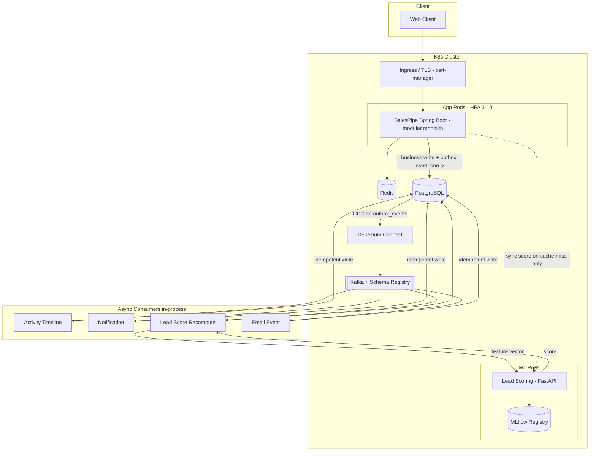

# SalesPipe — Implementation Plan: Overview

**Companion to:** `../../b2b-saas-crm-design-document.md` (SDD v1.0)
**Plan version:** 1.1
**Scope:** Buildable, production-correct implementation plan for all 6 phases, with improvements over the SDD baked in.

This document is the master reference. Each phase has its own detail doc (`phase-1` … `phase-6`). Read this first, then execute one phase doc per implementation session.

> **v1.1 note:** the SDD did not cover a frontend. Phase 6 (Next.js web client) is a plan-only addition — it's not in the original SDD, so it has no "changed vs SDD" entries below; see its own doc for full rationale.

---

## 1. What changed vs the SDD (decision log summary)

The SDD is the source of intent. This plan diverges deliberately where the SDD had correctness gaps or dated choices. Full rationale in §7 (Decision Log). Headline changes:

| # | Change | Reason |
|---|---|---|
| 1 | Added `processed_events` idempotency table | SDD said "dedupe on event_id" with no store. Dedupe is now a real unique-constraint insert. |
| 2 | Outbox relay = **Debezium CDC** (primary), polling relay (fallback) | No polling lag; true CDC is the senior story. Ordering via partition key = `aggregate_id`. |
| 3 | Feature-store writes folded into idempotent-consumer discipline | `lead_features` was a silent dual-write; now consistency-managed. |
| 4 | Partitioning + GIN indexes on `activities`, `email_events` | Append-only high-volume tables; SDD had zero partitioning. |
| 5 | HMAC-signed email tracking tokens | Prevents open/click forgery + tracking-id enumeration. |
| 6 | Refresh-token **reuse detection** (rotating families) | Replayed refresh token revokes the whole family. |
| 7 | **MLflow** model registry replaces hand-rolled S3 versioning | Standard registry, experiment tracking, A/B + rollback for free. |
| 8 | Dropped mandatory PCA-to-50; keep 384-dim embedding | PCA discards signal; GBDT handles wide dense input. PCA kept as documented tuning lever only. |
| 9 | **Async recompute is source of truth**; sync scoring = cache-miss/manual only | Removes SDD's sync/async ambiguity. |
| 10 | **Schema Registry** (JSON Schema) for Kafka events | SDD had hand-JSON with no evolution story. |
| 11 | Explicit HikariCP tuning + reporting read-replica note | Connection pool was unspecified. |
| 12 | GDPR/tenant hard-delete + data retention policy | B2B PII; deletion is a legal requirement, not a feature. |
| 13 | Flyway rollback/backup-restore story | Migration safety was unaddressed. |

---

## 2. Component tier map

Every component is labeled **CORE** (must build for a production-correct system) or **STRETCH** (adds platform polish; has a local-friendly fallback so the system runs without it). Don't build STRETCH until CORE of that phase is solid.

| Component | Tier | Local fallback if STRETCH |
|---|---|---|
| Spring Boot modular monolith | CORE | — |
| PostgreSQL + Flyway | CORE | — |
| Redis (cache, rate-limit, refresh tokens) | CORE | — |
| Kafka + outbox + idempotent consumers | CORE | — |
| Schema Registry | CORE | Embedded/single-node registry locally |
| Debezium CDC outbox relay | CORE | **Polling relay** (documented, ships as fallback) |
| Python FastAPI scoring service | CORE | — |
| MLflow model registry | CORE | Local MLflow with filesystem backend |
| Resilience4j (CB/retry/bulkhead) | CORE | — |
| Prometheus + Grafana + Micrometer | CORE | — |
| OpenTelemetry tracing | CORE | — |
| Structured JSON logs | CORE | stdout locally; Loki/ELK is STRETCH |
| Testcontainers integration tests | CORE | — |
| Docker multi-stage builds | CORE | — |
| Kubernetes + Helm | CORE | Docker Compose for local dev |
| Loki/ELK log aggregation | STRETCH | stdout + `docker logs` |
| KEDA (scale on Kafka lag) | STRETCH | HPA on CPU only |
| Argo CD (GitOps) | STRETCH | `helm upgrade` from CI |
| External Secrets Operator + Vault | STRETCH | plain K8s Secrets (+ documented gap) |
| Airflow (training orchestration) | STRETCH | Cron container / K8s CronJob |
| Elasticsearch full-text search | STRETCH | Postgres `tsvector` full-text |
| WebSocket/SSE live Kanban | STRETCH | Client polling |
| Gatling load tests | CORE (Phase 4) | — |
| Next.js frontend | CORE (Phase 6) | — |
| Typed API client (OpenAPI-generated) | CORE (Phase 6) | — |
| WebSocket/SSE live push (board + notifications) | STRETCH | Polling (implemented as the CORE path) |

---

## 3. Improved architecture



Key difference from SDD diagram: the app **never** produces to Kafka directly. It writes business state + an `outbox_events` row in one transaction; **Debezium** streams that table to Kafka. This is the transactional-outbox guarantee made real.

---

## 4. Corrected database schema

All tables carry `org_id` (except `organizations`). Every hot query path gets a composite index `(org_id, …)`. Types shown Postgres-flavored.

```sql
-- ── identity ──────────────────────────────────────────────
organizations (id UUID PK, name, plan, created_at)

users (
  id UUID PK, org_id FK, email CITEXT, password_hash,
  role,                         -- ADMIN | MANAGER | SALES_REP
  created_at,
  UNIQUE (org_id, email)
)

refresh_tokens (                -- rotating family, reuse detection
  id UUID PK, org_id, user_id,
  family_id UUID,               -- all rotations of one login share family
  token_hash,                   -- SHA-256 of the refresh token
  parent_id UUID NULL,          -- previous token in the chain
  used BOOLEAN DEFAULT false,   -- replaying a used token => revoke family
  expires_at, created_at,
  INDEX (token_hash)
)                               -- also mirrored/cached in Redis for fast revoke

-- ── crm-core ──────────────────────────────────────────────
accounts (id UUID PK, org_id, name, industry, employee_count, website, created_at)

contacts (
  id UUID PK, org_id, account_id FK, first_name, last_name,
  email CITEXT, phone, title
)

leads (
  id UUID PK, org_id, contact_id FK, account_id FK, source, status,
  raw_notes TEXT,               -- feeds embedding
  current_score NUMERIC(5,4),   -- cached latest
  owner_id FK, version INT,     -- @Version optimistic lock
  created_at, updated_at,
  INDEX (org_id, status), INDEX (org_id, owner_id)
)

-- ── pipeline ──────────────────────────────────────────────
deal_stages (id UUID PK, org_id, name, position, is_won, is_lost,
             UNIQUE (org_id, position))

deals (
  id UUID PK, org_id, lead_id FK, account_id FK, stage_id FK, owner_id FK,
  amount NUMERIC(14,2), currency CHAR(3), expected_close_date,
  entered_stage_at,             -- time-in-stage metric
  version INT,                  -- optimistic lock on Kanban drag
  created_at, updated_at,
  INDEX (org_id, stage_id)
)

deal_stage_history (
  id UUID PK, org_id, deal_id FK, from_stage_id, to_stage_id,
  changed_by, changed_at
)

-- ── activity (append-only, PARTITIONED BY RANGE(created_at) monthly) ──
activities (
  id UUID, org_id, entity_type, entity_id,     -- polymorphic: lead/deal/contact
  activity_type,                               -- CALL|EMAIL|NOTE|MEETING|STAGE_CHANGE
  payload JSONB, created_by, created_at,
  PRIMARY KEY (id, created_at),
  INDEX (org_id, entity_type, entity_id, created_at DESC),
  INDEX USING GIN (payload)
)

-- ── email-tracking ────────────────────────────────────────
emails (
  id UUID PK, org_id, deal_id, lead_id, subject, sent_at,
  tracking_id UUID,             -- opaque public id
  tracking_sig TEXT             -- HMAC(tracking_id, org secret) anti-forgery
)

email_events (                  -- append-only, PARTITIONED BY RANGE(occurred_at)
  id UUID, org_id, email_id FK, event_type, ip, user_agent, occurred_at,
  PRIMARY KEY (id, occurred_at),
  event_type CHECK IN ('OPENED','CLICKED','BOUNCED')
)

-- ── scoring / feature store ───────────────────────────────
lead_features (
  lead_id UUID PK, org_id,
  email_open_count, email_click_count,
  days_since_last_activity, activity_count_30d,
  deal_velocity_days, company_size_bucket,
  feature_version INT,          -- bumped on schema change
  updated_at
)

lead_scores (                   -- full history
  id UUID PK, org_id, lead_id FK, score NUMERIC(5,4),
  model_version,                -- MLflow model version/stage
  scored_at,
  INDEX (org_id, lead_id, scored_at DESC)
)

-- ── notification ──────────────────────────────────────────
notifications (id UUID PK, org_id, user_id, type, payload JSONB,
               read_at NULL, created_at)

-- ── eventing (outbox + idempotency) ───────────────────────
outbox_events (
  id UUID PK, org_id, aggregate_type, aggregate_id,
  event_type, payload JSONB,
  trace_id,                     -- OTel propagation across Kafka
  created_at
  -- NOTE: no `published` column; Debezium CDC streams every insert.
  -- Polling-relay fallback adds `published BOOLEAN DEFAULT false`.
)

processed_events (              -- idempotent-consumer dedupe
  consumer_group TEXT, event_id UUID, processed_at,
  PRIMARY KEY (consumer_group, event_id)
)

-- ── common / audit ────────────────────────────────────────
audit_log (id UUID PK, org_id, actor_id, action, entity_type,
           entity_id, diff JSONB, created_at)
```

**Notes**
- Partitioned tables (`activities`, `email_events`): monthly range partitions, `pg_partman` or Flyway-managed. Old partitions detachable for retention/archival.
- `outbox_events` intentionally has no `published` flag under CDC — Debezium reads the WAL, marking rows is a polling-relay concern only.
- Multi-tenancy: Hibernate `@Filter` on `org_id`, value from request-scoped tenant context resolved from JWT `org_id` claim — **never** from request body. Enabled globally, not opt-in.

---

## 5. Kafka topic + schema design

| Topic | Producer (via outbox) | Partition key | Consumers | DLQ |
|---|---|---|---|---|
| `deal.stage.changed` | pipeline | `deal_id` | activity, notification, scoring | `deal.stage.changed.DLQ` |
| `lead.created` | crm-core | `lead_id` | scoring, activity | yes |
| `email.event.received` | email-tracking | `lead_id` | activity, scoring | yes |
| `lead.score.updated` | scoring | `lead_id` | notification, activity | yes |
| `activity.logged` | multiple | `entity_id` | notification | yes |

- **Schema Registry** holds a JSON Schema per topic. Producers validate on serialize; consumers on deserialize. Backward-compatible evolution enforced (add optional fields only).
- Partition key choice gives per-aggregate ordering, which is what correctness needs (all events for one deal land on one partition, processed in order).
- Consumers: retry with Resilience4j exponential backoff N times, then publish to DLQ **with failure reason** — never silent drop.
- Every consumer dedupes via `processed_events` insert inside the same transaction as its business write. Duplicate delivery = unique-constraint violation = skip.

**Canonical event envelope** (all topics):
```json
{
  "event_id": "uuid",
  "event_type": "deal.stage.changed",
  "schema_version": 1,
  "org_id": "org_123",
  "aggregate_type": "deal",
  "aggregate_id": "deal_456",
  "occurred_at": "2026-07-08T10:15:00Z",
  "trace_id": "otel-trace-abc",
  "payload": { }
}
```

---

## 6. Cross-cutting specifications

### 6.1 Security
- Spring Security 6, stateless JWT. Short-lived access token (~15 min) + rotating refresh token.
- Refresh tokens stored **hashed** (SHA-256) in `refresh_tokens` + Redis mirror for O(1) revoke. **Reuse detection**: presenting a `used=true` token revokes the entire `family_id`.
- RBAC via `@PreAuthorize` on ADMIN/MANAGER/SALES_REP.
- Tenant isolation via Hibernate filter (see §4). Add an ArchUnit test that fails the build if any repository query bypasses the tenant filter.
- Email tracking endpoints: HMAC-signed `tracking_sig`; unsigned/invalid requests rejected before any DB write. Prevents forged opens + id enumeration.
- Rate limiting: Bucket4j + Redis, per-tenant, on tracking pixel + webhook ingestion.
- Secrets: plain K8s Secrets locally (CORE) with documented gap; External Secrets Operator + Vault as STRETCH.
- **GDPR/tenant deletion**: hard-delete job removes all `org_id` rows across every table + detaches archived partitions; documented retention windows for `activities`/`email_events`.

### 6.2 Observability
- **Metrics**: Micrometer → Prometheus. Track request latency/error per endpoint, Kafka consumer lag, DLQ depth, ML latency, circuit-breaker state, outbox relay lag. Grafana dashboards + Alertmanager rules.
- **Tracing**: OpenTelemetry. `trace_id` propagated in Kafka headers so a single "deal stage changed" is followable producer → CDC → consumer → DB → notification.
- **Logging**: structured JSON, MDC carries `org_id`, `trace_id`, `user_id`. stdout locally; Loki/ELK STRETCH.
- **Health**: Actuator `/health/liveness`, `/health/readiness` (fails while DB/Kafka unreachable), `startupProbe` for JVM boot.

### 6.3 Resilience
- Circuit breaker (Resilience4j) around ML scoring calls + outbound email provider.
- Retry + exponential backoff on Kafka consume before DLQ.
- Idempotency keys on client-retryable writes (email send) + the `processed_events` store for events.
- Bulkhead isolating ML-call thread pool from DB-call pool.
- Timeouts on every outbound HTTP call — no unbounded waits.
- Java 21 virtual threads for I/O-bound consumers/HTTP calls.

### 6.4 Persistence & performance
- HikariCP: pool sized from load tests (start `maximumPoolSize` ≈ `(core_count × 2) + effective_spindle`, tune from Phase 4 numbers). Explicit `connectionTimeout`, `maxLifetime` under DB idle-timeout.
- Reporting reads target a read-replica (documented; single instance locally).
- Flyway: forward-only migrations in prod; documented rollback = compensating migration + tested restore-from-backup, not `flyway undo`.

---

## 7. Decision log (interview gold)

Each row: choice, the alternative you rejected, and why. This is what "20 minutes on any section" is built from.

| Decision | Chosen | Rejected | Why |
|---|---|---|---|
| Deployment unit | Modular monolith (Spring Modulith) | Microservices | No distributed tx, one deploy to trace/debug; module boundaries enforced in CI so extraction later is a deploy change not a rewrite. |
| Event bus | Kafka | RabbitMQ | Replay (re-score all leads on new model), fan-out via consumer groups, KEDA lag scaling. RabbitMQ evaluated for pure task-queue notifications; replay won. |
| Outbox relay | Debezium CDC | Polling relay | No poll lag, reads WAL, exactly the durable-CDC story. Polling ships as fallback. |
| Delivery semantics | At-least-once + idempotent consumers | Exactly-once (Kafka EOS) | EOS adds coordinator cost/complexity; idempotency via `processed_events` is simpler and equally correct here. |
| Multi-tenancy | Shared schema + `org_id` filter | Schema-per-tenant | Standard at this scale; schema-per-tenant is the documented scaling escape hatch. |
| Model registry | MLflow | Hand-rolled S3 + version strings | Experiment tracking, stage transitions, A/B, rollback out of the box. |
| Text features | 384-dim MiniLM embedding, full | PCA→50 dims | GBDT handles wide dense input; PCA discards signal. PCA kept as a tuning lever only. |
| Scoring path | Async recompute = truth; sync = cache-miss | Sync-on-request | UI never blocks on ML latency; fallback returns last-known score. |
| Event schemas | Schema Registry (JSON Schema) | Hand-JSON | Enforced backward-compatible evolution. |
| ML language | Python FastAPI service | ML in Java | Mature sentence-transformers/XGBoost ecosystem; don't fight it. |

---

## 8. Phase sequencing & effort

Rough solo-dev effort (calendar, part-time). Sizing is directional, not a commitment.

| Phase | Focus | Effort | Demo at end |
|---|---|---|---|
| 1 | Core CRUD monolith | ~2–3 wk | Auth + Kanban board working, dockerized, on K8s |
| 2 | Event backbone | ~2–3 wk | Activity timeline populates async; email opens tracked |
| 3 | AI lead scoring | ~2–3 wk | Leads show live conversion score + history + SHAP factors |
| 4 | Production hardening | ~2 wk | Grafana dashboards, traces, DLQs, published Gatling p99 |
| 5 | Platform polish | ~1–2 wk | Helm + KEDA + GitOps, one-command deploy |
| 6 | Frontend (Next.js) | ~2–3 wk | Full web client: Kanban, lead detail w/ live score + SHAP, notifications, reports |

**Rule**: do not start a phase before the prior phase's CORE items pass their acceptance tests. An interviewer poking Phase 1 fundamentals and finding them shaky discounts everything above.

**Note:** Phase 6 only needs Phases 1–4's APIs (auth, pipeline, timeline, scoring) to be usable — it can be built in parallel with Phase 5 if working solo across two tracks, though the default sequencing above still applies for a single-track build.

---

## 9. Suggested package / repo structure

```
com.salespipe
 ├── identity/      (api, domain, infra, IdentityModule)
 ├── crmcore/
 ├── pipeline/
 ├── activity/
 ├── emailtracking/
 ├── scoring/       (client → WebClient to ML service)
 ├── notification/
 ├── eventing/      (outbox, producer, consumer, schema)
 ├── reporting/
 └── common/        (tenant, audit, exception)
```
Each module declares its Spring Modulith boundary via `package-info.java`; `ApplicationModules.of(SalesPipeApplication.class).verify()` runs in CI. Cross-module talk only via public API interface or domain events — never a foreign repository.

The **frontend** (Phase 6) lives as a sibling top-level directory, not inside `com.salespipe`:
```
/
├── (backend Java modules above)
├── ml/            (Python FastAPI scoring service, Phase 3)
└── frontend/      (Next.js app, Phase 6)
```

---

## 10. Reading list
- *Designing Data-Intensive Applications* (Kleppmann) — outbox, event streaming
- Spring Modulith reference
- Debezium outbox-event-router SMT docs
- Confluent Schema Registry docs
- Resilience4j reference
- MLflow model registry docs
- KEDA Kafka scaler docs
